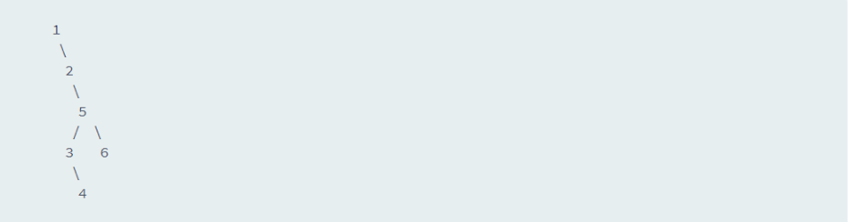

# Tree: Postorder Traversal
[Solve and submit this problem yourself here](https://www.hackerrank.com/challenges/tree-postorder-traversal/problem)
## Problem
Complete the postOrder function in your editor below, which has  parameter: a pointer to the root of a binary tree. It must print the values in the tree's postorder traversal as a single line of space-separated values.

**Input Format**   
Our hidden tester code passes the root node of a binary tree to your postOrder function.

**Constraints**  
 1 <= Nodes in the tree <= 500

**Output Format**  
Print the tree's postorder traversal as a single line of space-separated values.

**Sample Input**  


**Sample Output**  
```
4 3 6 5 2 1
```
